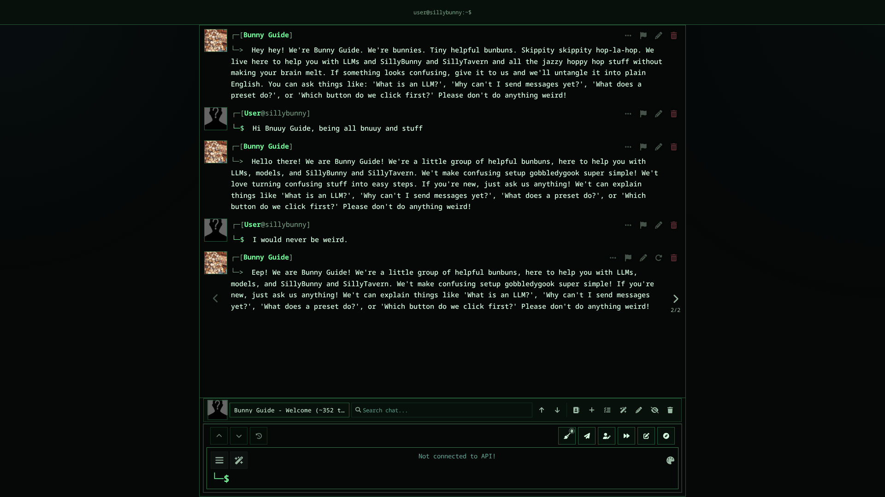

# SillyBunny Terminal UI

A command-first interface for [SillyBunny](https://github.com/SillyBunnyTeam/SillyBunny). It keeps the native chat prompt and slash-command system, then reduces the surrounding UI to a tmux-style statusline, flat transcript, and fzf-like command results.



## Interaction

The normal SillyBunny composer remains the only prompt:

- Plain text sends chat.
- A leading `/` uses SillyBunny slash commands and autocomplete.
- `Alt+Up` and `Alt+Down` use native input history.
- `Ctrl+Space` opens or expands native command autocomplete.
- Terminal density starts as a centered, prompt-only REPL; `/home` reveals the native Home page when needed.
- The empty state shows a Claude Code-style guide next to the prompt mascot: `/home`, `/newchat`, `/chat-manager`, `/sbterm characters`, `/sbterm groups`, and `/sbterm`.
- The bottom chat-management bar is removed. Touch layouts retain the native 44px send control because Enter-to-send is disabled there by default.

Terminal density is enabled by default. It removes optional composer controls and keeps only conditional stop/script controls plus mobile send. Run `/sbterm ui full` at any time to restore the complete host chrome.

## `/sbterm`

Terminal UI adds `/sbterm` and `/home` and does not replace native commands such as `/api`, `/model`, `/preset`, `/theme`, `/chat-manager`, `/go`, or `/newchat`.

| Command | Action |
| --- | --- |
| `/sbterm status` | Show the live character/chat, API/model, run state, and last prompt token diagnostics |
| `/sbterm on` / `/sbterm off` | Enable or disable the interface without disabling the extension |
| `/sbterm ui terminal` / `/sbterm ui full` | Switch terminal density or full host chrome |
| `/sbterm palette <slug>` | Select one of the 13 palettes |
| `/sbterm crt on` / `/sbterm crt off` | Toggle the optional CRT overlay |
| `/sbterm <destination>` | Open a SillyBunny shell or workspace |
| `/home` | Reveal the native Home page hidden by terminal density |

Destinations: `workspace`, `presets`, `api`, `sampling`, `formatting`, `agents`, `customize`, `settings`, `extensions`, `background`, `server`, `logs`, `characters`, `groups`, `editor`, `world-info`, `persona`, `import`, `search`, `chat-tools`, `appearance`, `home`, `conversation`, and `roleplay`.

The same `/sbterm` command works from Conversation Mode. Its existing `/selfie`, `/remind`, `/schedule`, `/summarize`, `/ooc`, and normal message behavior are left untouched.

## Statusline

The top line reports real host state, for example:

```text
chat:Nahida/Rooftop Talk | api:openrouter/claude-3.7 | run:idle | prompt:11.8k/32.8k
```

Prompt tokens are counted from the last fully assembled request. Conversation Mode can use a scoped connection, so it reports `prompt:n/a` rather than showing stale Roleplay data.

## Palettes

`phosphor-green`, `terminal-amber`, `gameboy-dmg`, `teletext`, `chrome-98`, `dos-cobalt`, `paper-tape`, `vfd-cyan`, `dracula`, `gruvbox`, `solarized-dark`, `nord`, and `inherit`.

CRT scanlines are optional and off by default. Motion stops under `prefers-reduced-motion`; the overlay is removed under forced colors or increased contrast.

## Install

Clone or symlink the extension into:

```text
data/<user-handle>/extensions/SillyBunny-Terminal-UI
```

Reload SillyBunny, then configure it under **Extensions > Terminal UI**. Settings use SillyBunny's standard extension store.

## Development

```sh
npm test
npm run lint
```

The extension ships as native browser modules with no build step or runtime dependency.

## License

AGPL-3.0
